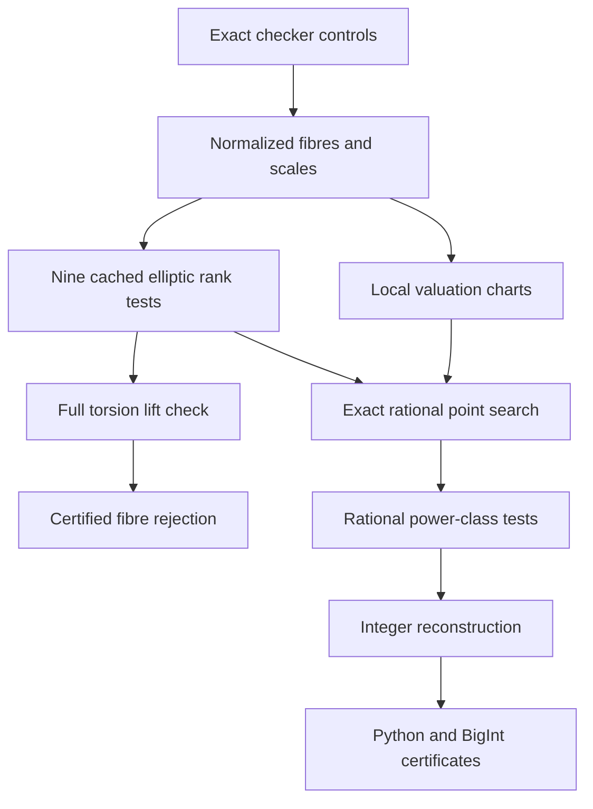

# Twisted-fibre arithmetic: exact derivation and operational consequences

2026-09-10. No counterexample is claimed. The full proofs and an independent
audit are in [INDEPENDENT_AUDIT.md](INDEPENDENT_AUDIT.md). This note specifies
the arithmetic used by the executable search, before its results are counted.

## Exact reduction

Fix `c=sum(ai^6)>0` and write the fibre as `A^6+cS^6=B^6`.
Its square map to `X^3+cY^3=Z^3` has degree four. On `Y!=0`, putting
`u=Z/Y`, `v=X/Y` gives exactly `c=u^3-v^3`. Conversely every such pair
gives `[v:1:u]`. The desired lift exists if and only if `u,v` are both
nonzero rational squares. The cubic always has the rational boundary point
`[1:0:1]`, so merely establishing a rational point proves nothing here.

The Mordell model is

```
eta^2=xi^3-432c^2,
xi=12c/(u-v), eta=36c(u+v)/(u-v),
u=(eta+36c)/(6xi), v=(eta-36c)/(6xi).
```

For `c>0`, every affine rational Mordell point has `xi>0`; the only missing
point is the identity. Its affine points correspond exactly to rational
cube differences. A square lift further requires `eta>36c` and both exact
rational square tests. No floating reconstruction enters this pipeline.

## Cover geometry and the local obstruction that does not exist

The three coordinate divisors on the smooth cubic each contain three
distinct geometric points and are disjoint. `X/Z` has odd valuations on
the X and Z divisors, and `Y/Z` on the Y and Z divisors. Each individual
double cover therefore branches at six points and has genus four. Their
connected composite has degree four, with order-two inertia at each of
nine points (including diagonal inertia at the Z divisor). Its total
ramification is eighteen, giving genus ten. This agrees with the plane
sextic genus formula. The third intermediate double cover also has genus four.

These covers are ramified. Their square evaluations are not automatically
homomorphisms on the elliptic group, and they are not ordinary unramified
2-Selmer covers. A 2-descent can bound an elliptic rank without settling
the required branched square conditions.

Every fibre has nonzero points over every Q_p and over R. Indeed, at the
smooth rational boundary point `[1:0:1]`, `1+cS^6=B^6` has derivative
`6` in B; the local implicit-function theorem gives B near 1 for sufficiently
small nonzero S. Thus an unrestricted congruence or local-solubility test
cannot close a fibre. The implementation records the forced 2,3,7 valuation
charts and **never** promotes failure of a unit-S chart to fibre insolubility.

## Five additional elliptic quotients

The genus-two quotient `w^2=t^6+c`, with `t=A/S`, `w=(B/S)^3`, is useful.
The degree-three map from the sextic ramifies at its six simple w-zeros;
the two infinity poles have order three and are unramified. This gives
another independent genus-ten calculation. The genus-two Jacobian has
elliptic factors with coefficients c and c^2. Permuting coordinate roles
gives the following exact degree-six maps:

| Model `y^2=x^3+b` | x | y | Lift conditions |
|---|---|---|---|
| b=c | `(A/S)^2` | `(B/S)^3` | x square, y cube |
| b=-c | `(B/S)^2` | `(A/S)^3` | x square, y cube |
| b=c^2 | `c(S/A)^2` | `c(B/A)^3` | x/c square, y/c cube |
| b=-c^3 | `c(B/A)^2` | `c^2(S/A)^3` | x/c square, y/c^2 cube |
| b=c^3 | `-c(A/B)^2` | `c^2(S/B)^3` | -x/c square, y/c^2 cube |

All required roots are nonzero and rational. Absolute values recover
positive sextic coordinates when the cube root is negative. The explicit
coordinate equations, rather than only a rank comparison, prove each test
is necessary and sufficient. The infinity points are excluded boundaries.

Any one of the six elliptic quotients can certify rejection: prove its
rank upper bound is zero, enumerate its entire rational torsion group,
and fail every exact lift. Torsion alone is not a survivor; for example
`(0,±c)` on b=c^2 is boundary. In positive rank, checking known points or
a finite subgroup box remains only a bounded search, even if the rank
bounds coincide. Known independent points need not form a saturated basis.

Three further **degree-twelve** maps, derived from product genus-two
quotients, add the coefficients `4c,-4c,4c^4`. Their exact maps and inverse
square/cube tests are in Section 10 of INDEPENDENT_AUDIT.md and in the
independently checked decoder. The final executable therefore uses **nine
distinct coefficient formulas**, rather than only the original six.

Ten explicit maps (including a second map to the c^2 coefficient) pull
back to the ten independent plane-sextic differentials. This proves

```
Jac(C_c) ~ E_c * E_(-c) * E_(c^2)^2 * E_(-c^3) * E_(c^3)
             * E_(-432c^2) * E_(4c) * E_(-4c) * E_(4c^4),
```

where here `E_b` denotes `y^2=x^3+b`. The rank is the sum of the nine
elliptic ranks, counting the c^2 factor twice. The rational Neron–Severi
rank is at least eleven, so certified Jacobian rank upper bound at most
nineteen meets the quadratic-Chabauty finiteness inequality. More practical
are the five genus-two quotients whose two elliptic ranks are both one.
These are applicability statements; no quadratic-Chabauty height computation
or complete rational-point classification is claimed. The independent
audit supplies proofs and the precise primary-literature hypotheses.

## Normalization, descent, and the executed DAG

First divide each integer fourtuple by its gcd and sort it. For its sum
`c_raw=h^6*c`, index the fibre by the positive sixth-power-free c, and
store the rational representation `ai/h`. Equal c-values share a ledger
row. Each elliptic coefficient is independently normalized as `b=hE^6*b0`;
the stored coordinate change is `(x,y)=(hE^2*x0,hE^3*y0)`.
This caches b=-432c^2 by cube class and b=±c^3 by square class while
preserving the required lift classes. It does not claim a classification
of all possible abstract curve isomorphisms.

The ±c^3 quotients have rational 2-torsion, making their rank computation
particularly cheap. The execution order uses them first, then b=c,-c,c^2,
and finally the requested cube-difference quotient. It is a rejection-cost
choice justified by exact quotient identities, not a change in target.



PARI/GP 2.17.4 was built from its hash-verified official source and passed
the bundled ellrank, elltors, ellratpoints regression suites. Before using
a rank upper bound, all cubic bnf structures in the version-pinned
ellrank initialization are explicitly passed through `bnfcertify`. Errors,
timeouts, missing fields, or failed certificates remain unresolved. Raw
outputs, exact points, program hashes, wall-clock limits, model scales,
and rejection reasons are retained. See `runtime_manifest.json` and the
[official PARI documentation](https://pari.math.u-bordeaux.fr/dochtml/html/Elliptic_curves.html).

A further genuine finite descent is available by allocating the prime-to-6
part of c among the four cyclotomic factors of `B^6-A^6`. Outside 2 and 3
they are pairwise coprime; each factor is a prescribed sixth-power-free
coefficient times a sixth power. Its compatibility equations remain to be
solved. Section 7 of the independent audit gives the precise scope; this
note does not claim the allocation systems were all executed or resolved.
